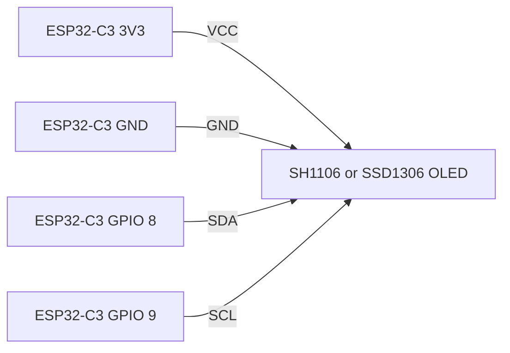
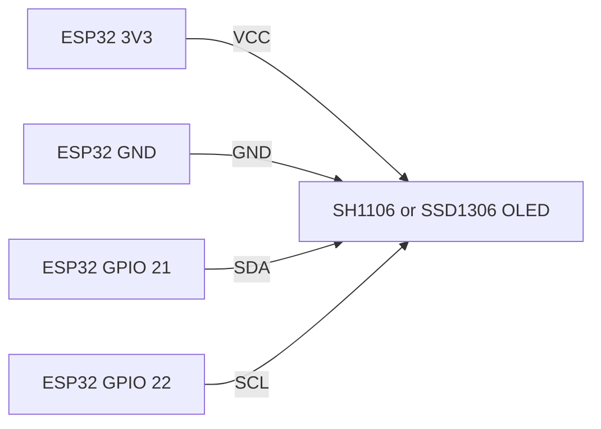

# RATHINAMO OLED Animation: ESP32 Setup Guide

This project plays Rathinamo song's pre-rendered monochrome animation on a 128x64 I2C OLED. It includes four combinations for the commonly used ESP32 Dev Module and ESP32-C3 SuperMini boards with SH1106 and SSD1306 displays:

| Sketch folder | Microcontroller | OLED controller | Typical display | I2C pins in sketch |
| --- | --- | --- | --- | --- |
| `ESP32C3_SH1106_128x64` | ESP32-C3 SuperMini | SH1106 (Adafruit SH110X) | 1.3-inch, 128x64 | SDA GPIO 8, SCL GPIO 9 |
| `ESP32C3_SSD1306_128x64` | ESP32-C3 SuperMini | SSD1306 (Adafruit SSD1306) | 0.96-inch, 128x64 | SDA GPIO 8, SCL GPIO 9 |
| `ESP32_Dev_SH1106_128x64` | ESP32 Dev Module | SH1106 (Adafruit SH110X) | 1.3-inch, 128x64 | SDA GPIO 21, SCL GPIO 22 |
| `ESP32_Dev_SSD1306_128x64` | ESP32 Dev Module | SSD1306 (Adafruit SSD1306) | 0.96-inch, 128x64 | SDA GPIO 21, SCL GPIO 22 |

The listed display diagonals are common examples, not requirements. Select by controller and resolution: both sketches expect a 128x64 panel, so these common sizes use the same frame dimensions.

## Wiring

Connect the OLED's I2C pins to the matching board pins below. Connect grounds together. Use 3.3V for VCC unless the OLED module documentation explicitly permits another voltage.

### ESP32-C3 SuperMini + either display controller

| OLED pin | ESP32-C3 SuperMini pin |
| --- | --- |
| VCC | 3V3 |
| GND | GND |
| SDA | GPIO 8 |
| SCL | GPIO 9 |



Use these same board connections with either the SH1106 or SSD1306 C3 sketch. The sketch uses GPIO 8 and GPIO 9 as written. ESP32-C3 SuperMini board revisions and pin labels can vary; verify your board pinout before wiring. GPIO 9 can also be a boot-strapping pin on ESP32-C3 boards, so avoid external circuitry that holds it low during reset.

### ESP32 Dev Module + either display controller

| OLED pin | ESP32 Dev Module pin |
| --- | --- |
| VCC | 3V3 |
| GND | GND |
| SDA | GPIO 21 |
| SCL | GPIO 22 |



Use these same board connections with either the SH1106 or SSD1306 Dev Module sketch. These are the common default I2C pins for the ESP32 Dev Module. If you change the wiring, update `SDA_PIN` and `SCL_PIN` in that sketch to match.

## Arduino IDE Setup

1. Install Arduino IDE.
2. In Boards Manager, install **esp32 by Espressif Systems**.
3. In Library Manager, install **Adafruit GFX Library** and the controller library for the display you are using:
   - SH1106 sketch: **Adafruit SH110X**.
   - SSD1306 sketch: **Adafruit SSD1306**.
4. Open the `.ino` file inside the folder matching both your board and display controller. For example, open `ESP32C3_SSD1306_128x64/ESP32C3_SSD1306_128x64.ino` for a C3 and SSD1306 combination.
5. Select the board, connect the board over USB, and select its port:
   - ESP32-C3 SuperMini: select **ESP32C3 Dev Module** (board package naming can vary).
   - ESP32 Dev Module: select **ESP32 Dev Module** or the exact DevKit entry for your board.
6. Select **Upload**. If upload fails, check the selected port and board; some C3 boards require holding **BOOT** while upload begins.
7. Open Serial Monitor at **115200 baud** to check for display allocation errors.

## Sketch Settings

All four sketches currently set:

- Resolution: 128x64 pixels.
- I2C address: `0x3C`.
- Animation: 150 monochrome bitmap frames, advanced approximately every 124 ms.

If the OLED does not initialize, confirm its controller, wiring, and I2C address. Some modules use `0x3D`; if so, change `SCREEN_ADDR` in the selected sketch. If your panel is not 128x64, these frames will not match its resolution without resizing or regenerating the image data.

For a blank or unstable display, check the following:

- Confirm SDA and SCL are not swapped and match the sketch's pin definitions.
- Confirm the controller library matches the chip on the module; SH1106 and SSD1306 are not interchangeable in the sketch configuration.
- Confirm the module supply voltage and I2C address from its documentation or an I2C scanner.
- Check the Serial Monitor for `SH1106 allocation failed` or `SSD1306 allocation failed`.

## License and Credit

Hardware-specific setup/adaptation code and this project's documentation are by **techbuilds-by-ak**: [github.com/techbuilds-by-ak](https://github.com/techbuilds-by-ak). You may use, modify, and redistribute those portions under the MIT License below.

The embedded animation bitmap frames are excluded from this license. Their original source attribution and applicable terms remain in place; check those terms before reusing or redistributing the artwork.

```text
MIT License

Copyright (c) 2026 techbuilds-by-ak

Permission is hereby granted, free of charge, to any person obtaining a copy
of the hardware-specific setup/adaptation code and documentation covered by
this notice (the "Software"), to deal in the Software without restriction,
including without limitation the rights to use, copy, modify, merge, publish,
distribute, sublicense, and/or sell copies of the Software, and to permit
persons to whom the Software is furnished to do so, subject to the following
conditions:

The above copyright notice and this permission notice shall be included in
all copies or substantial portions of the Software.

THE SOFTWARE IS PROVIDED "AS IS", WITHOUT WARRANTY OF ANY KIND, EXPRESS OR
IMPLIED, INCLUDING BUT NOT LIMITED TO THE WARRANTIES OF MERCHANTABILITY,
FITNESS FOR A PARTICULAR PURPOSE AND NONINFRINGEMENT. IN NO EVENT SHALL THE
AUTHORS OR COPYRIGHT HOLDERS BE LIABLE FOR ANY CLAIM, DAMAGES OR OTHER
LIABILITY, WHETHER IN AN ACTION OF CONTRACT, TORT OR OTHERWISE, ARISING FROM,
OUT OF OR IN CONNECTION WITH THE SOFTWARE OR THE USE OR OTHER DEALINGS IN THE
SOFTWARE.
```

